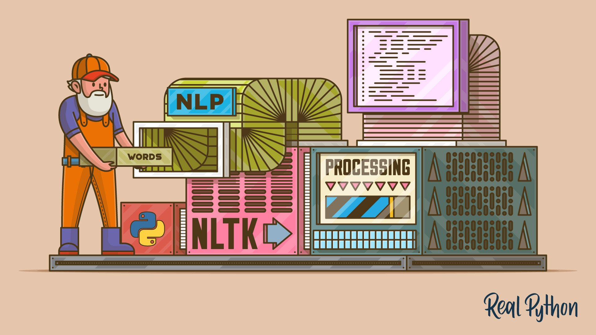
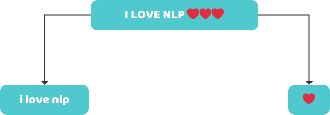
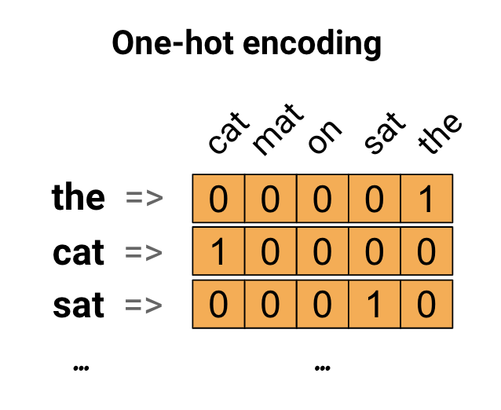
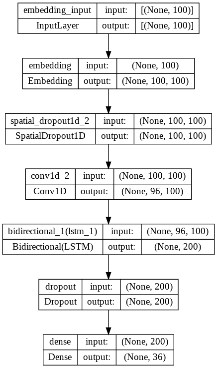
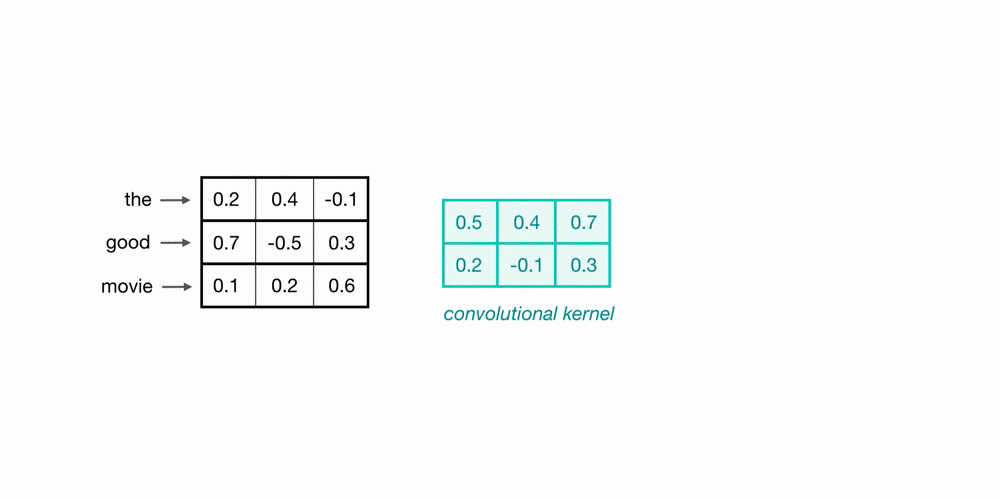

# Emojification
I made this notebook for when I was giving a workshop in collaboration with Google Cloud at the AI+X Summit 2022 in Zurich. This was meant to introduce NLP problems in Deep Learning to the audience. The example we used was a bot that recommends emojis based on the user's input sentence. 
# Introduction
The ACE workshop is built around the idea that the best way to learn something new is by getting a hands-on experience. Leanring something new is a journey form where you are now to where you want to be and this workshop is just a vechicle to get you there. We hope that you find it to be a productive and enjoyable learning experience. In this workshop we will walk you through how to build a deep learning model to add fun emojis to sentences.

I love this workshop

I love this workshop    __🥰__ 

# How to proceed?

# 

Fetching Our Data

Preparing the Data

Building the Model

Train and Test

# Fetching Data

# Find Good Data!!

We recommend Kaggle

Lots of large and varied datasets

Very easy to implement

# 

# Choosing the Right Data

You need lots of data \(millions\)

Watch out for unbalanced datasets

Know what will be most useful 

# Data Processing

# Our Goals

Clean

Classify

Balance

Make Machine Readable

# 

# Cleaning

Normalise our Data \(e\.g lower case\)

Keep the essential \(e\.g removing “stop words”\)

NLTK package

# 

# Classification

Emojis define our classes

Separate emoji from text

# 

# Balancing Dataset

Remove classes with insufficient text

Imbalance leads to overfitting

We want the same amount of data for every class 

# 

# Transforming Tweets

* Strings can’t be used\, so we must transform them
* Vectorise the data : 
  * Make it part of our model
  * Transform text dataset
* We will apply the transformation on the dataset

# 

# Transforming Tweets - Keras text tokenizer

* We use the Tokenizer class to create a word\-to\-index dictionary
* Fit on texts 
  * Creates vocabulary index based on word frequency
  * e\.g “The car drove around the track”
    * dict\[“the”\] = 1
    * dict\[“car”\] = 2
* Texts to sequences
  *  _Transforms each text into a sequence of integers_ 

# 

# Encoding Outputs

One Hot Encoding

Easy and Effective

# Building the Model

# What do we want from our model?

Handles textual data

Takes on sequential data

Considers context

Efficient

Doesn’t overcomplicate

# Vectorisation

## Word Embeddings

Words are assigned real\-valued vectors

They hold context and semantic

Similar words are close together

## One hot Encoding

Creating a zero vector with equal then place 1 in the index that corresponds to the word

Inefficient : most elements are 0

# 

# Word Embeddings

* Represents implicit relationships between words
  * Helps us gain contextual information
  * Similar words have similar encoding
  * Boosts generalisation and performance
* Pre\-trained model : GloVe \(Global Vectors for Word Representation\)

# 

# Embedding Layer

* Create a lookup table which relates a word to its corresponding word embedding
* Attach matrix to the keras Embedding Layer
* Make it easier to take on large inputs
  * e\.g sparse vectors representing words
* Captures the semantic of sentence effectively

# 

# Spatial Dropout 1D

Prevent overfitting

Spatial Dropout drops entire feature maps

Makes our model dropout entire phrases and forces it to generalise better

# 

# Convolutional Layer

* Performs window\-based feature extraction
  * e\.g patterns in sequential word groupings indicating certain emotions
* Trains to pull out the essential of a sentence \(attention\)

# 

# Bidirectional LSTM

* Takes current and preceding inputs into consideration
* Able to catch long term dependencies
* Reads sentence in both directions
  * Incorporating future time steps helps understand context better

# 

# Output Layer

* Softmax activation function
  * best for multi\-class classification
* Returns one hot array representing emoji

