 __Vertex AI__ 

Put the best of Google’s AI technologies to work

Unified development and deployment platform for data science and machine learning

Oct 2022

_Vertex AI Pre\-Trained Models_

Generally available

    * AutoML Translation

    * Video Intelligence

    * Natural Language

    * AutoML  Video Intelligence

    * AutoML  Natural Language

Best in class tools allowing customers to leverage Google’s leadership in AI to solve common problems 

Structured data

    * Time Series Insights API

    * Vertex AI Forecast

    * Fleet Routing API

No code / low code workflow

Data Science tool kit

 __Integration with__ 

 __Data Services__ 

Unified development and deployment platform for data science and machine learning

Increase productivity of data scientists and ML engineers

Model Monitoring

 __Vertex AI Workbench__ 

A one\-stop surface for Data Science

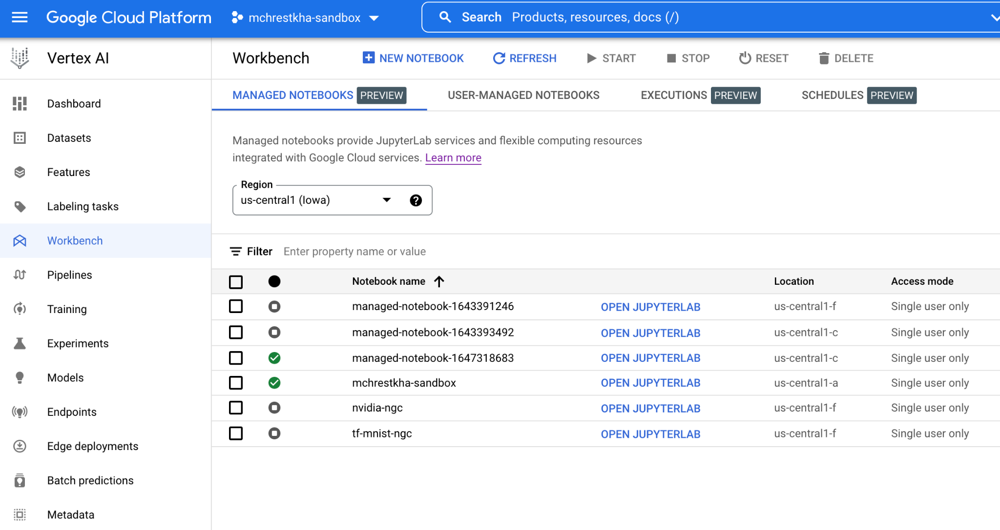

 __Fully managed compute with admin control__ 

A Jupyter\-based fully managed\, scalable\, enterprise\-ready compute infrastructure with easily enforceable policies and user management

 __Fast workflow for data tasks__ 

Seamless visual and code\-based integrations with data & analytics services

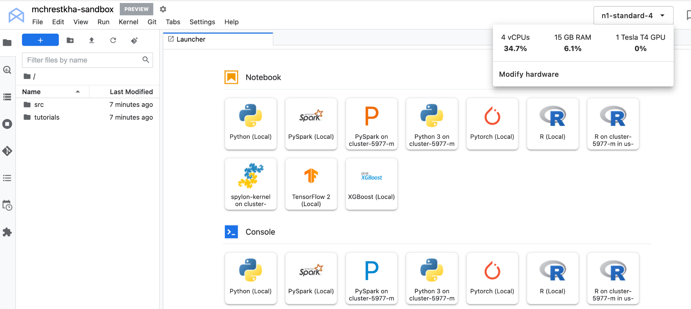

 __At\-your\-fingertips integration__    

Load and share notebooks alongside your AI and data tasks\. Run tasks without extra code

# Vertex AI Set Up Instruction

Task 1: Create a notebook instance in Vertex AI Workbench

1\.  From the Google Cloud Console    __Navigation Menu__   \, select    __Vertex AI__   \. From the Dashboard\, select the    __Workbench__    menu item

2\. In the  __User\-Managed Notebooks__  tab\,  press the    __\+ New Instance__    button at the top of the screen\.

3\.  Select    __TensorFlow Enterprise __   >   __ TensorFlow Enterprise 2\.6 \(with LTS\) __   >   __ Without GPUs__   :

4\.  In the pop\-up\, confirm the name of the deep learning VM\, move to the bottom of the window and click    __CREATE__   :

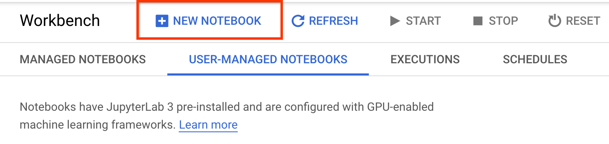

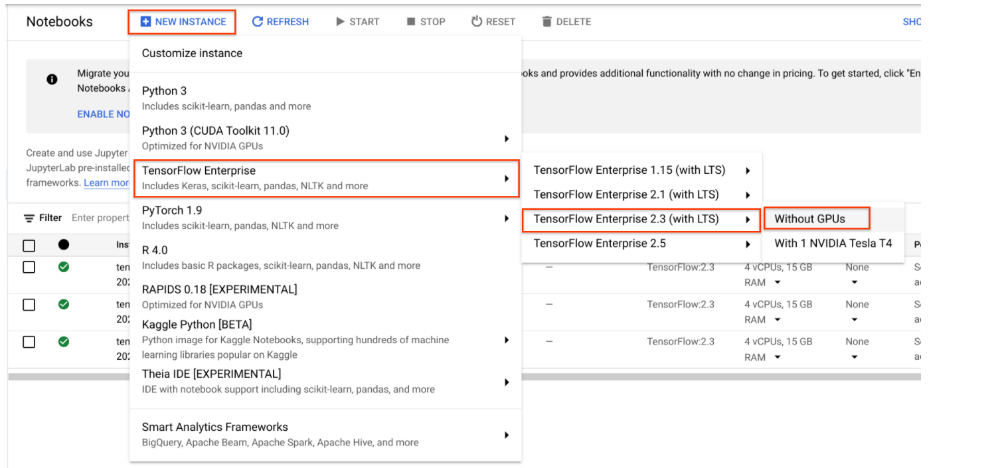

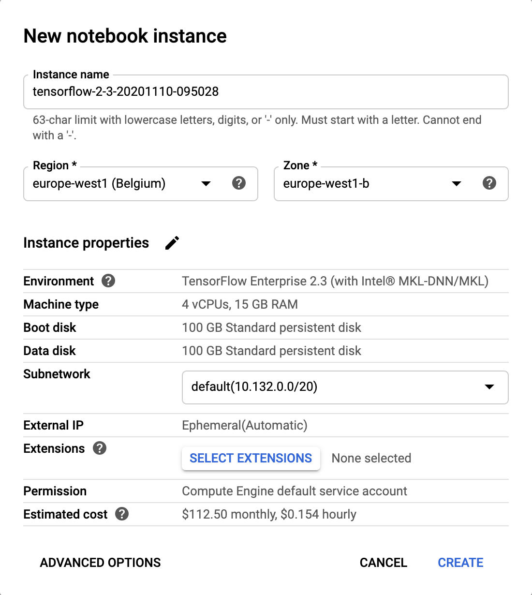

Task 1: Create a notebook instance in Vertex AI Workbench

5\.  The notebook instance will now be provisioned\. 

This typically takes 3\-5 minutes\.

6\. When it is ready click the   __OPEN JUPYTERLAB__  link\.

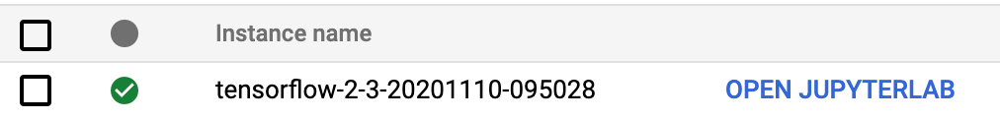

Task 2: Copy the notebook into your Vertex Workbench instance

1\. In JupyterLab\, click the Terminal icon to open a new terminal\.

2\. At the command\-line prompt\, type in the following command and press Enter\.

Use the   gsutil cp   command to upload the training notebook as well as an image that will be used to your notebook instance:

3\. Confirm that you have copied both items by ensuring that you can see it in your directory on the left\.

| gsutil cp gs://ta-reinforecement-learning/aix/Emojification.ipynb . |
| :-: |

| gsutil cp gs://ta-reinforecement-learning/aix/Emojification.ipynb . |
| :-: |

# Additional Lab to Practice NLP and Vertex AI (by D-Labs)

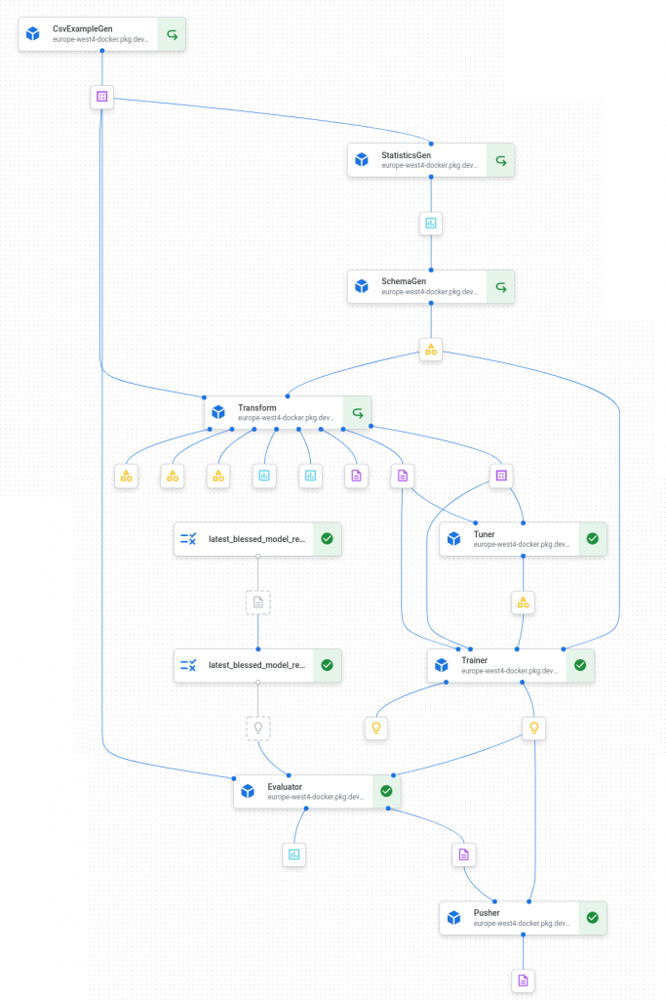

__Sentiment Analysis using BERT on Vertex AI __ \(incl\. TFX and Vertex Pipelines\)

_[https://dlabs\.ai/resources/courses/bert\-sentiment\-analysis\-on\-vertex\-ai\-using\-tfx/](https://dlabs.ai/resources/courses/bert-sentiment-analysis-on-vertex-ai-using-tfx/)_

# Tackle Any NLP Problem

# Adding Emojis to your Sentences

I love this workshop  __🥰__

I love this workshop

# How to proceed?

# 

Fetching Our Data

Preparing the Data

Building the Model

Train and Test

# Fetching Data

# Find Good Data!!

We recommend Kaggle

Lots of large and varied datasets

Very easy to implement

# Fetching Data

# Choosing the Right Data

You need lots of data \(millions\)

Watch out for unbalanced datasets

Know what will be most useful

# Data Processing

# Our Goals

Clean

Classify

Balance

Make Machine Readable

# Data Processing

# Cleaning

Normalise our Data \(e\.g lower case\)

Keep the essential \(e\.g removing “stop words”\)

NLTK package

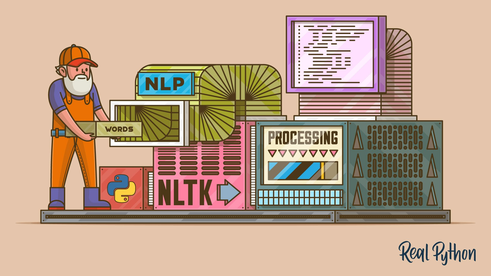

# Data Processing

# Classification

Emojis define our classes

Separate emoji from text

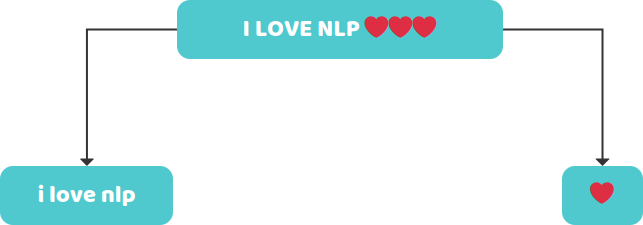

# Data Processing

# Balancing Dataset

Remove classes with insufficient text

Imbalance leads to overfitting

We want the same amount of data for every class

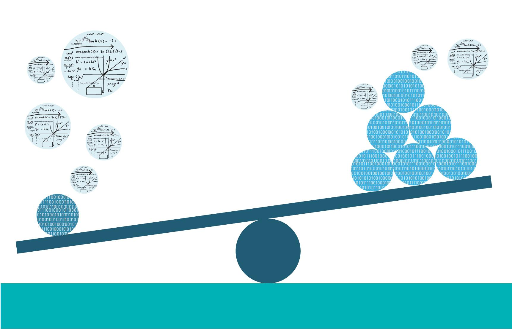

# Data Processing

# Transforming Tweets

* Strings can’t be used\, so we must transform them
* Vectorise the data :
  * Make it part of our model
  * Transform text dataset
* We will apply the transformation on the dataset

# Data Processing

# Transforming Tweets - Keras text tokenizer

* We use the Tokenizer class to create a word\-to\-index dictionary
* Fit on texts
  * Creates vocabulary index based on word frequency
  * e\.g “The car drove around the track”
    * dict\[“the”\] = 1
    * dict\[“car”\] = 2
* Texts to sequences
  * _Transforms each text into a sequence of integers_

# Data Processing

# Encoding Outputs

One Hot Encoding

Easy and Effective

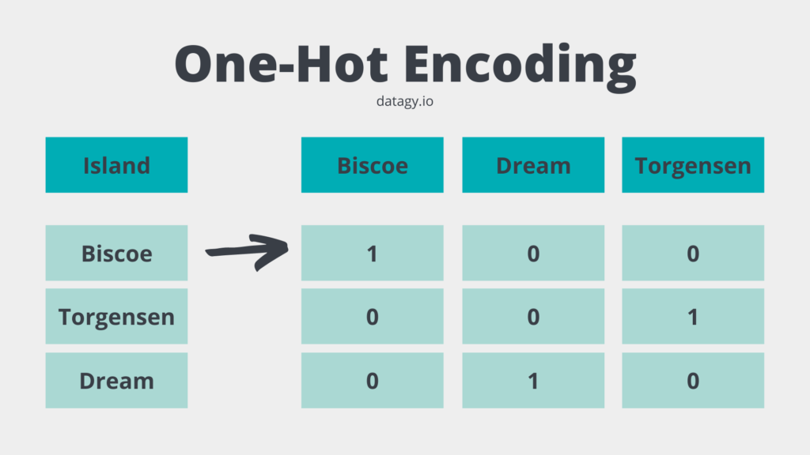

# Building the Model

# What do we want from our model?

Handles textual data

Takes on sequential data

Considers context

Efficient

Doesn’t overcomplicate

# Building the Model - Vectorisation

# Word Embeddings

# One hot Encoding

Words are assigned real\-valued vectors

They hold context and semantic

Similar words are close together

Creating a zero vector with equal then place 1 in the index that corresponds to the word

Inefficient : most elements are 0

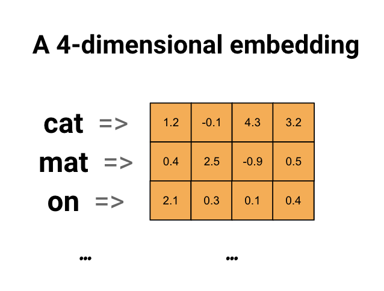

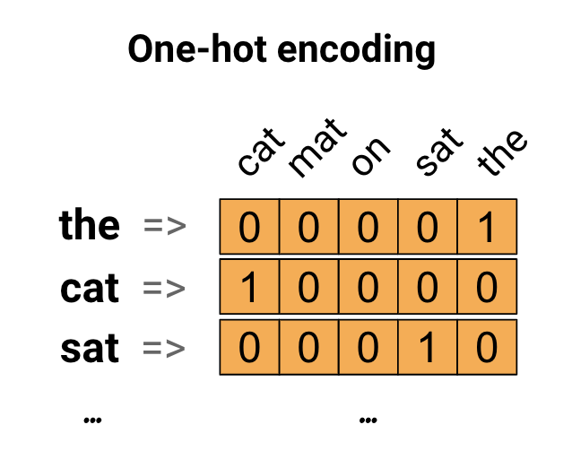

# Building the Model

# Word Embeddings

* Represents implicit relationships between words
  * Helps us gain contextual information
  * Similar words have similar encoding
  * Boosts generalisation and performance
* Pre\-trained model : GloVe \(Global Vectors for Word Representation\)

# Building the Model

# Embedding Layer

* Create a lookup table which relates a word to its corresponding word embedding
* Attach matrix to the keras Embedding Layer
* Make it easier to take on large inputs
  * e\.g sparse vectors representing words
* Captures the semantic of sentence effectively

# Building the Model

# Spatial Dropout 1D

Prevent overfitting

Spatial Dropout drops entire feature maps

Makes our model dropout entire phrases and forces it to generalise better

# Building the Model

# Convolutional Layer

* Performs window\-based feature extraction
  * e\.g patterns in sequential word groupings indicating certain emotions
* Trains to pull out the essential of a sentence \(attention\)

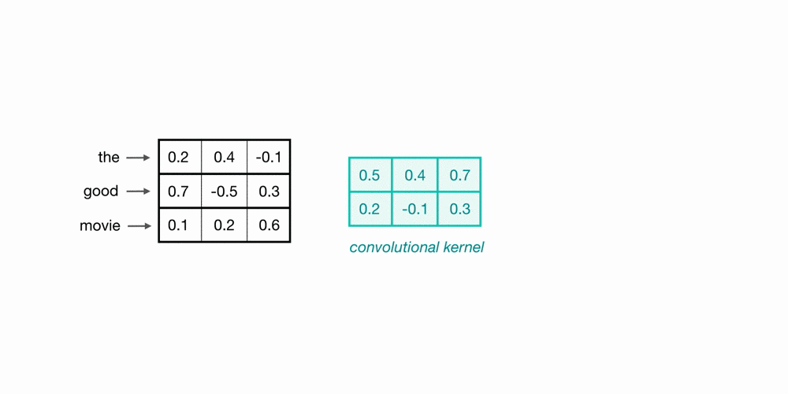

# Building the Model

# Bidirectional LSTM

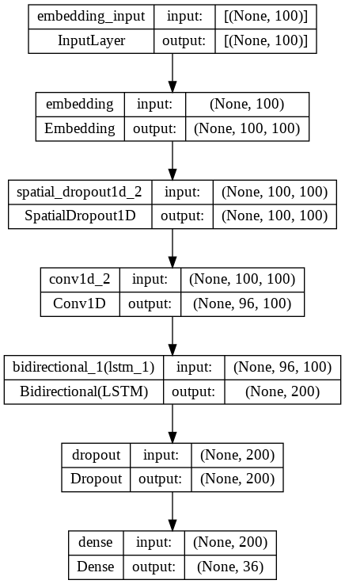

* Takes current and preceding inputs into consideration
* Able to catch long term dependencies
* Reads sentence in both directions
  * Incorporating future time steps helps understand context better

# Building the Model

# Output Layer

* Softmax activation function
  * best for multi\-class classification
* Returns one hot array representing emoji

# How to Upload a Notebook

# Vertex AI

# Google Colab

_[https://blog\.tensorflow\.org/2022/05/5\-steps\-to\-go\-from\-notebook\-to\-deployed\.html](https://blog.tensorflow.org/2022/05/5-steps-to-go-from-notebook-to-deployed.html)_

_[https://stackoverflow\.com/questions/48849938/how\-to\-directly\-upload\-a\-jupyter\-notebook\-from\-local\-machine\-onto\-google\-collab](https://stackoverflow.com/questions/48849938/how-to-directly-upload-a-jupyter-notebook-from-local-machine-onto-google-collab)_

